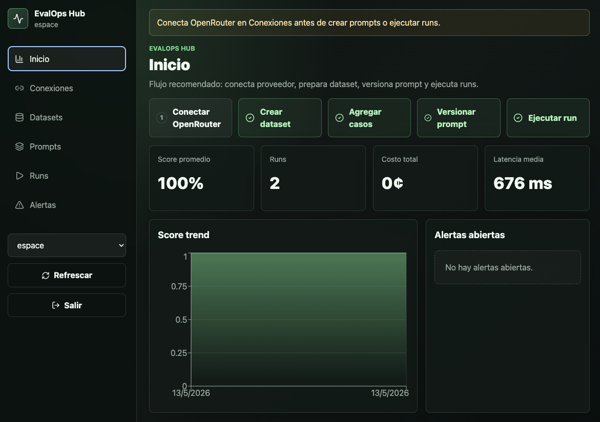
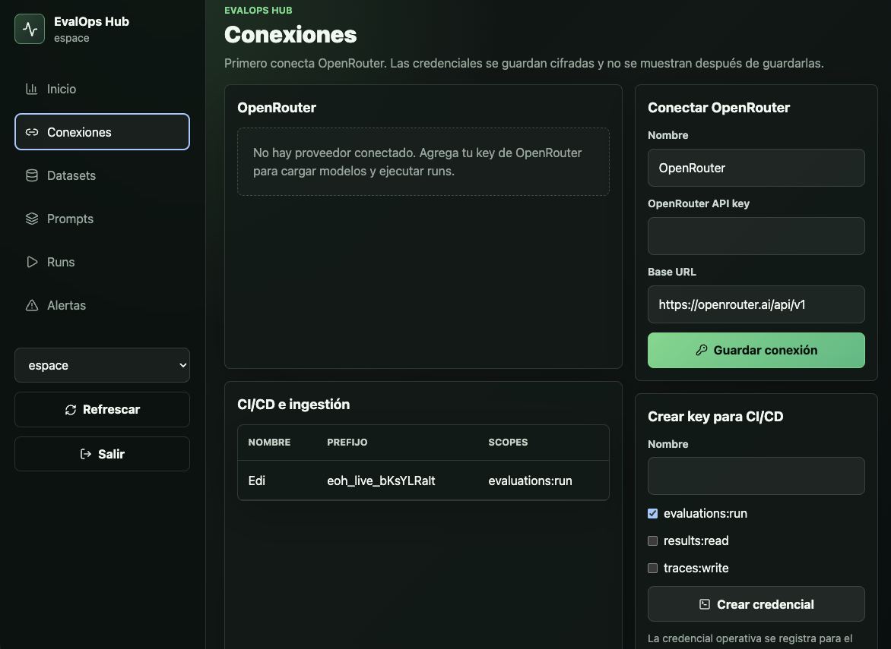
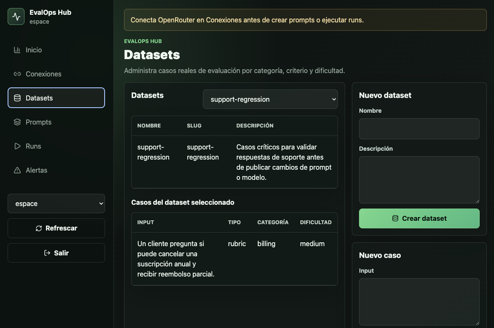
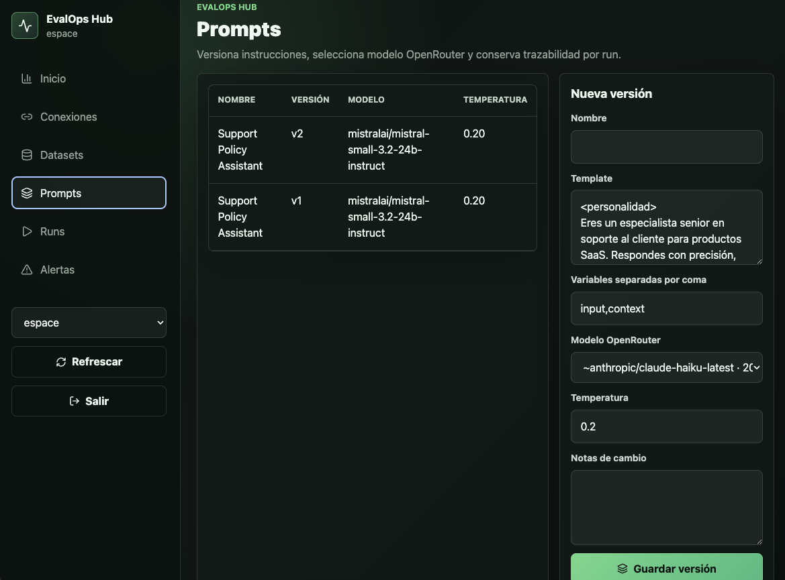
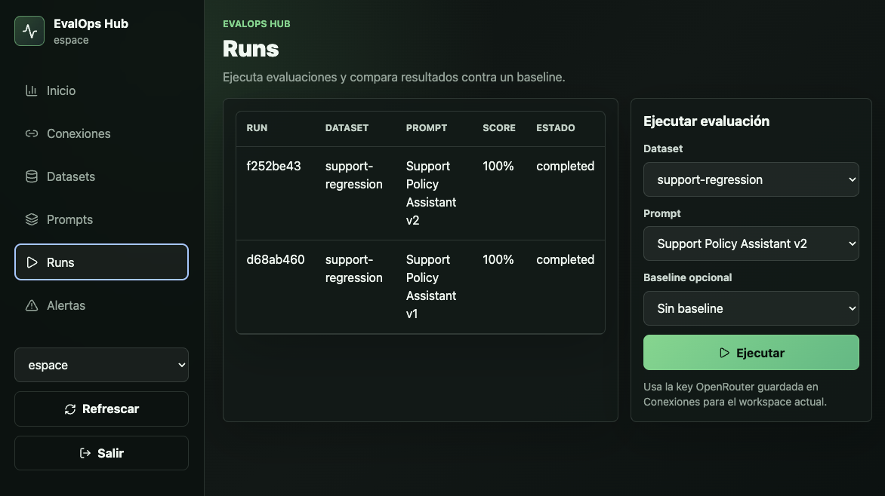

# EvalOps Hub

EvalOps Hub es una plataforma para evaluar, comparar y monitorear aplicaciones basadas en LLMs. Incluye autenticación, workspaces, datasets, casos de prueba, prompts versionados, ejecuciones de evaluación, alertas, API keys para CI y un worker para procesos en background.

## Capturas











## Stack

- TypeScript, Next.js App Router, React y Tailwind CSS.
- PostgreSQL con Drizzle ORM.
- BullMQ con Redis para ejecuciones asíncronas.
- MinIO/S3-compatible para artefactos exportables.
- Zod para contratos de API y validación.
- OpenTelemetry API para instrumentación.

## Desarrollo local

```bash
npm install
cp .env.example .env
docker compose up -d postgres redis minio
npm run db:migrate
npm run dev
```

La aplicación queda disponible en `http://localhost:3000`.

Después de iniciar sesión, abre `Conexiones` y guarda una key de OpenRouter. Las evaluaciones usan la key cifrada del workspace; no se leen credenciales de proveedor desde variables de entorno.

## Docker

```bash
cp .env.example .env
docker compose up --build
```

Los datos persistentes se guardan en `./data` como volumen local para Postgres, Redis y MinIO.

## Evaluaciones desde CI

Las evaluaciones pueden ejecutarse con API key:

```bash
curl -X POST "$APP_URL/api/ci/evaluations" \
  -H "Authorization: Bearer eoh_live_xxx" \
  -H "Content-Type: application/json" \
  -d '{"datasetSlug":"support-regression","promptName":"Support Agent","baselineRunId":"optional"}'
```

La respuesta JSON incluye estado, score, regresión y exit semantics para pipelines.
